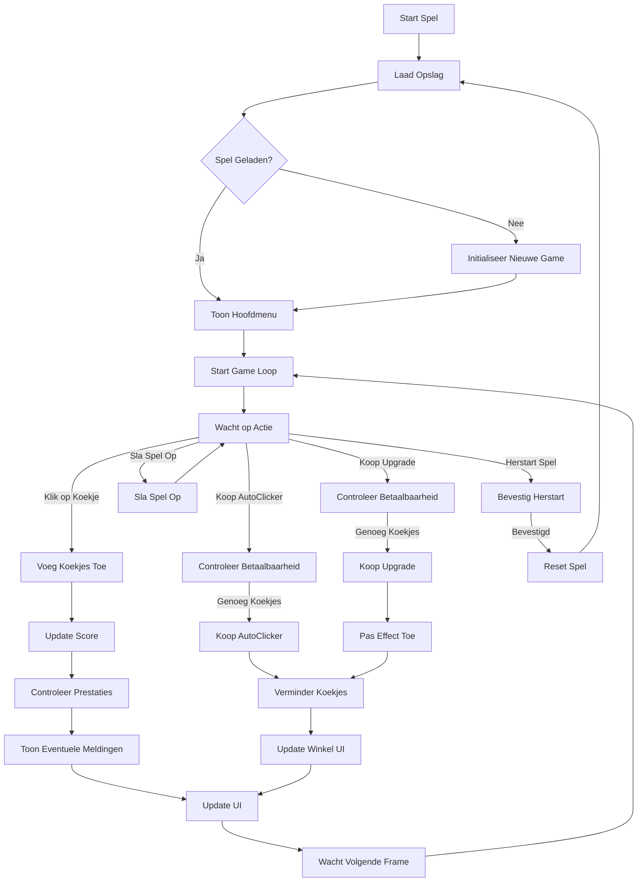

# Activiteitendiagram Cookie Clicker

```mermaid
flowchart TD
    A[Start Spel] --> B[Laad Opslag]
    B --> C{Spel Geladen?}
    C -->|Ja| E[Toon Hoofdmenu]
    C -->|Nee| D[Initialiseer Nieuwe Game]
    D --> E
    E --> F[Start Game Loop]
    F --> G[Wacht op Actie]
    
    G -->|Klik op Koekje| H[Voeg Koekjes Toe]
    H --> I[Update Score]
    I --> J[Controleer Prestaties]
    J --> K[Toon Eventuele Meldingen]
    K --> L[Update UI]
    
    G -->|Koop AutoClicker| M[Controleer Betaalbaarheid]
    M -->|Genoeg Koekjes| N[Koop AutoClicker]
    N --> O[Verminder Koekjes]
    O --> P[Update Winkel UI]
    P --> L
    
    G -->|Koop Upgrade| Q[Controleer Betaalbaarheid]
    Q -->|Genoeg Koekjes| R[Koop Upgrade]
    R --> S[Pas Effect Toe]
    S --> O
    
    L --> T[Wacht Volgende Frame]
    T --> F
    
    G -->|Sla Spel Op| U[Sla Spel Op]
    U --> G
    
    G -->|Herstart Spel| V[Bevestig Herstart]
    V -->|Bevestigd| W[Reset Spel]
    W --> B
```

## Legenda
- **Rechthoeken**: Acties/stappen
- **Ruiten**: Beslissingen (ja/nee)
- **Pijlen**: Flow van het proces
- **Rondingen**: Start/eindpunten
