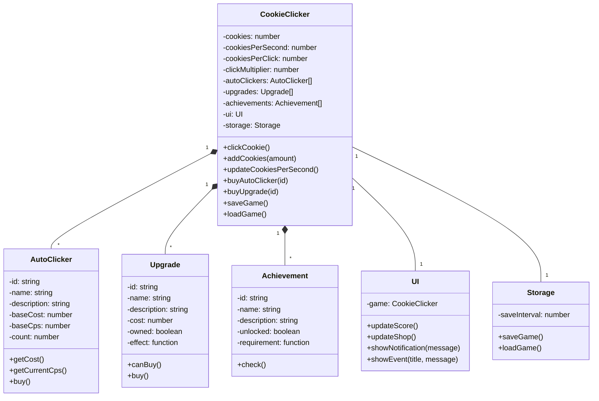

# Klassendiagram Cookie Clicker

```mermaid
classDiagram
    class CookieClicker {
        -cookies: number
        -cookiesPerSecond: number
        -cookiesPerClick: number
        -clickMultiplier: number
        -autoClickers: AutoClicker[]
        -upgrades: Upgrade[]
        -achievements: Achievement[]
        -ui: UI
        -storage: Storage
        +clickCookie()
        +addCookies(amount)
        +updateCookiesPerSecond()
        +buyAutoClicker(id)
        +buyUpgrade(id)
        +saveGame()
        +loadGame()
    }

    class AutoClicker {
        -id: string
        -name: string
        -description: string
        -baseCost: number
        -baseCps: number
        -count: number
        +getCost()
        +getCurrentCps()
        +buy()
    }

    class Upgrade {
        -id: string
        -name: string
        -description: string
        -cost: number
        -owned: boolean
        -effect: function
        +canBuy()
        +buy()
    }

    class Achievement {
        -id: string
        -name: string
        -description: string
        -unlocked: boolean
        -requirement: function
        +check()
    }

    class UI {
        -game: CookieClicker
        +updateScore()
        +updateShop()
        +showNotification(message)
        +showEvent(title, message)
    }

    class Storage {
        -saveInterval: number
        +saveGame()
        +loadGame()
    }

    CookieClicker "1" *-- "*" AutoClicker
    CookieClicker "1" *-- "*" Upgrade
    CookieClicker "1" *-- "*" Achievement
    CookieClicker "1" -- "1" UI
    CookieClicker "1" -- "1" Storage
```

## Uitleg relaties
- `*--` = Compositie (sterke eigenaarschap)
- `--` = Associatie (zwakke relatie)
- `1` = Eén instantie
- `*` = Meerdere instanties
